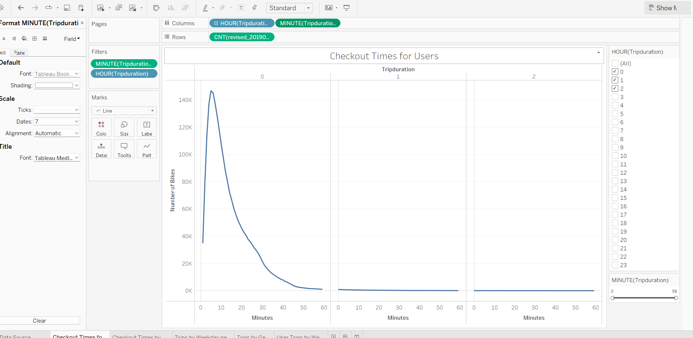
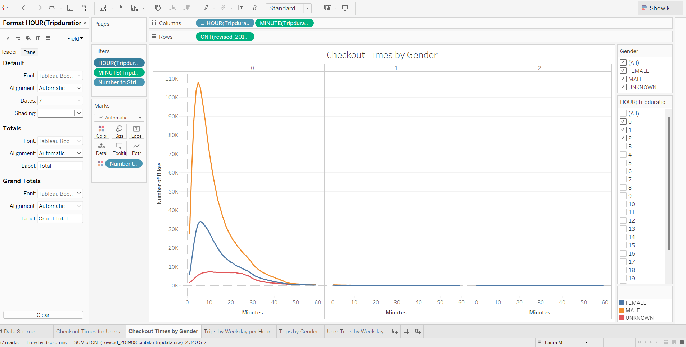
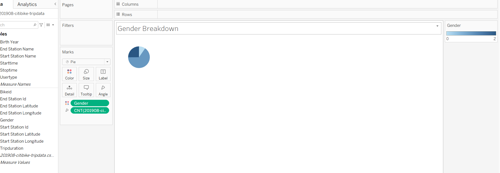
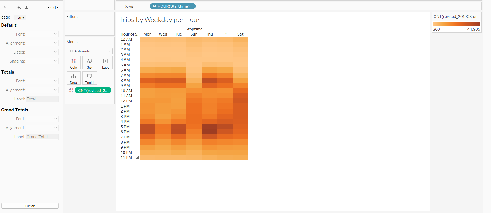
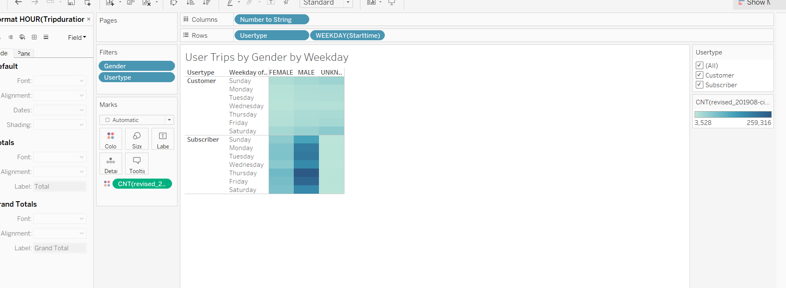
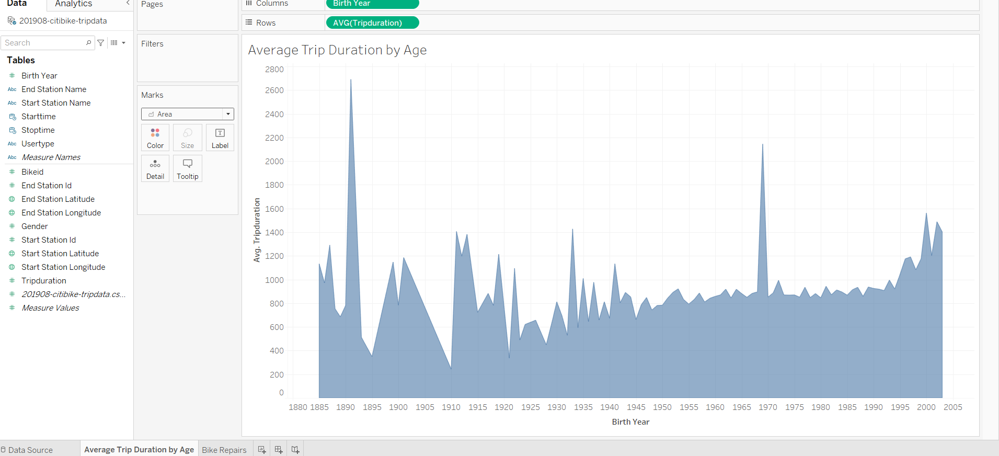

# NYC bikesharing with Citbike and Tableau - Challenge Number 14

## Overview

For this challenge we evaluated citibike data in New York City using Tableau and Pandas.  By revising the inital dataset and extracting the data into a new csv file, we were able to provide specific visualizations showing different demographics.  As a result of the end of the analysis, we were able to create 5 different visualizations breaking down the citibike data trips by gender, usertype and weekdays.  The link to my Tableau Public profile with the visulations can be found below. 

[link to dashboard](https://public.tableau.com/views/bikesharing_16617458939780/UserTripsbyWeekday?:language=en-US&:display_count=n&:origin=viz_share_link)

## Results

***
* Results by Checkout Times

For the first visualization, we graphed the length of time that bikes are checked out for each type of user.  It appears that based upon the data, the majority of citibike users take rides under an hour, whereas the number of rides which take over an hour to two hours are significantly lower. 

Furthermore, it appears that the males are taking longer rides than those of female users as shown in the visualization below as their checkout times are later. 

* Results by Gender

The main focus of this analysis was Gender.  By creating a calcuated field and the Gender data to a number to string, we were able to transform the initial Gender data from being recognized as either 0, 1, or 2 where 0 represents "Unknown," 1 represents "Male," and 2 represents "Female".  As the visualization below indicates, it appears that there are there are more male users vs. female or unknown gender users.  

As supported by the visualization above showing checkout times, men appear to be utlizing the citibike rides more often than women.  Furthermore it appears that men use the citibikes during the weekday for times that correlate with commuting to work.  As shown by the graph below, the majority of rides taken during the week appear to be between the hours of 7 a.m. to 9 a.m. and 5 p.m. to 7 p.m.

.png)

* Results by Trip

As we moved along in the analysis, we continued to break the results down this time by trips.  As the graph below shows, it appears that the majority of weekday rides are taken between the hours of 7 a.m. to 9 a.m. and 5 p.m. to 7 p.m. which can indicate that the bikes are largely being used to assist commuters within the city.  

It can also be noted that the number of rides taken on the weekend drop significantly. 

The last graph breaks down the rides between types of users, customers vs. subscribers.  To support or analysis that males favor the citibike vs. females, this graph shows once again that there are more rides taken by males than females.  Furthermore, there appear to be more male subscribers than females.  It can also be noted that there are a fair amount of unknown genders as customers. 

One last point of the data which was found during the module, was that suprisingly there are a fair amount of more senior users taking longer rides.

## Summary

In conclusion, based upon the overall analysis of the data, it can be noted that males tend to favor the citbikes over females.  In addition, the most popular times are during the early morning and late afternoon times.  In order to take the level of analysis one step further, we could use data and visualizations to show the most popular areas of the city where the bikes are being used.  In addition to supporting our theory of the commuting users, we could take the duration of the rides one step further to show the distance in which the user is riding to show whether it is truly for commuting a long distance or just for convenience for a few blocks. 
